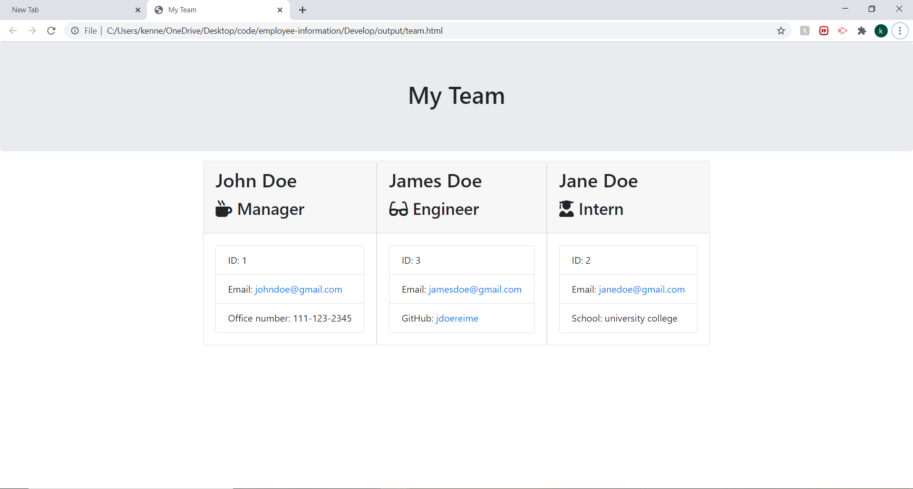

# Employee Information

This project lets you makes an information page for your whole team. Enter in your manager plus your team members in which you can select your team member roles from intern or engineer. Enter in your team information and each team role has a an attribute specific to them. Inputs will be done through a CLI and the generated html file will be located inside the output folder.